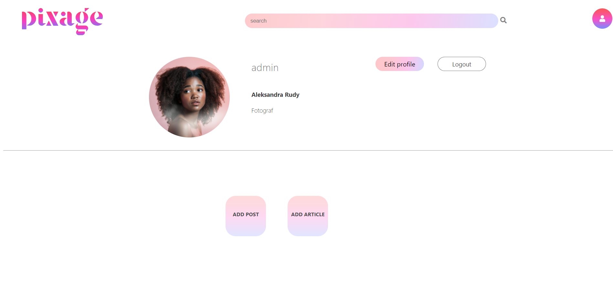

# PIXAGE
Pixage jest to aplikcja skierowana dla fotografow profesjonalnych jak i dla fotografow amatorskich, którzy chcą poszerzać swoje horyzonty w tej dziedzinie. 

## Opis 
System zapewnia użytkownikowi dodawanie zdjęć, jego opis, parametry zdjęcia i specyfikacje sprzętu przy pomocy którego zdjęcie zostało zrobione. W ramach Pixage użytkownik ma możliwość również dodawania artykułów dotyczących fotografii.
Użytkownik po poprawnej rejestracji loguje się do systemu, który przekierowuje go na stronę główną na której wyswietlone są wszystkie zdjęcia użytkowników aplikacji. Ze strony głównej użytkownik ma możliwość przejścia do zakładki Artykuły, na której znajdują się wszystkie artykuły dodane przez użytkowników. System zapewnia również podgląd profilu użytkownika, w któym znajduje się przycisk służacy do wylogowywania, przycisk przenoszący nas do formularzu z edycją danych profilu oraz przycisku dodawania zdjęcia i artykułu.
Do dodawania zdjęcia służy formularz w któym użytkownik uzupełnia dane takie jak: opis zdjęcia, nazwa aparatu i nazwa obiektywu który posłużył do wykonania zdjęcia. Określa paremetry: Lampa błyskowa (włączona/wyłączona), Wartość przysłony (np. f/2.8), Swiatło (Naturalne, Studyjne itp.), Czas naświetlania (np. 1/200s), Ogniskowa (np. 50mm), ISO (np.200), wybieraz z wysuwanej listy kategorię do której przypisuje zdjęcie i co najważniejsze wybiera zdjęcie z urządzenia poprzez wciśnięcie przycisku "Choose a file". Na końcu wciska przycisk "Add image".
Dodawanie artykułów jest jeszcze prostsze. Uzytkownik po kliknięciu w przycisk "Add article" uzupełnia formularz składający się z pola "Title", "Content" oraz dodaje zdjęcie banerowe artykułu za pośrednictwem przycisku "Choose a file". Na końcu podobnie jak w przypadku dodawania zdjęcia, wciska przycisk "Add article".
System zapewnia również edycję danych profilu użytkownika między innymi zdjęcia profilowe użytkownika, ale również "Firstname", "Surname", "Biogram". Dokonuje się tego za pomocą przycisku "Edit profile" w profilu użytkownika.  
Pixage pozwala również na wyszukiwanie zdjęć po opisie oraz kategorii.

## ERD

## Wygląd aplikacji PIXAGE

